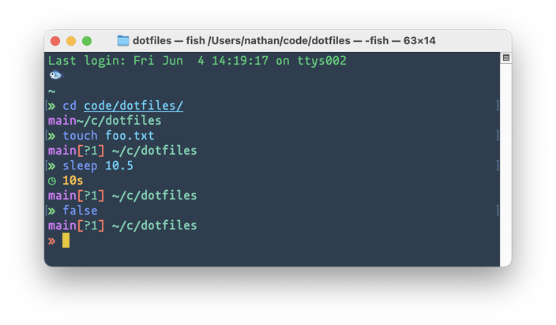
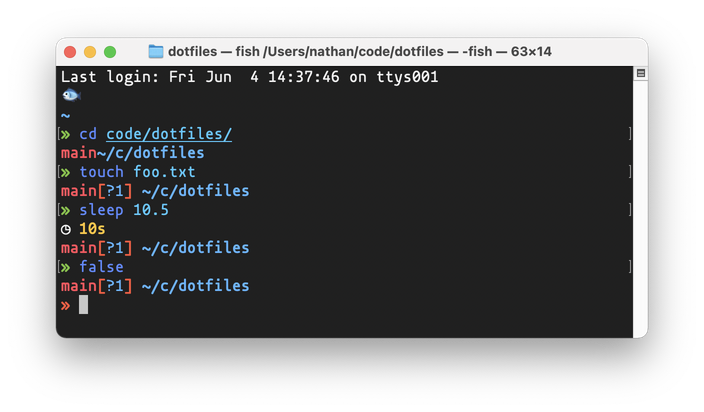
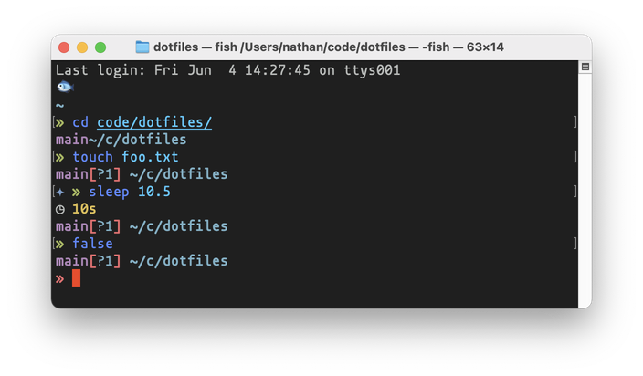

# Dotfiles

Personal dotfiles for anoldguy. Requires `stow` to manage installation of dotfiles, and has lots of [`fish`](https://fishshell.com/)-specific stuff. The prompt is all [`starship`](https://starship.rs) tho!

## Installation

1. Fork repo
2. Clone repo
3. `cd path/to/repo`
4. Run `./setup.sh`

## Removal

1. `cd path/to/repo`
2. Run `./setup.sh -c`

## Other Options

```bash
./setup.sh -h
```

## Terminal Themes

I've included a couple of my fav terminal themes. Flat has been my default for years, but both the Elementary and Dimmed Monokai look promising.




